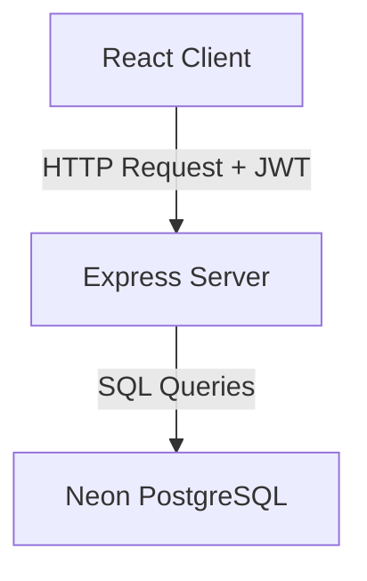
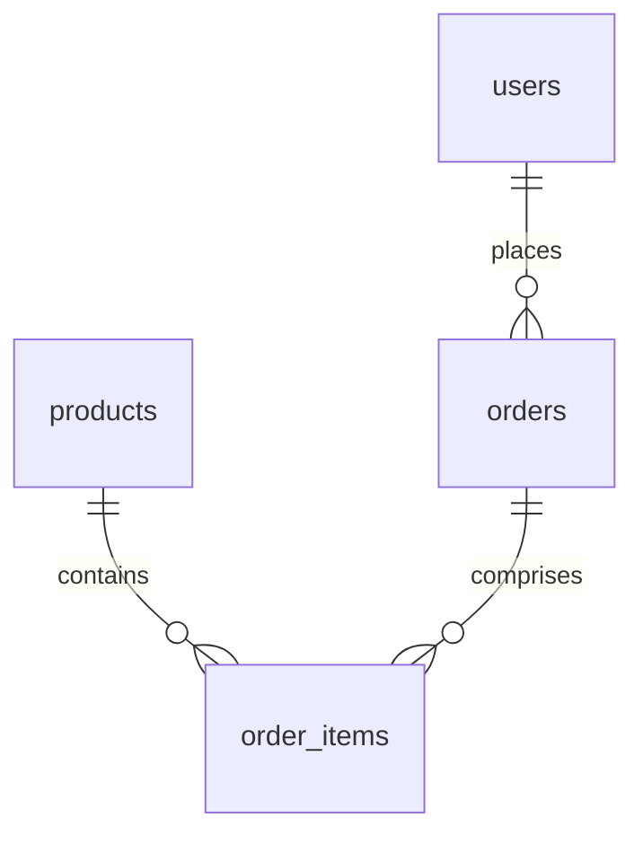

# AasaMedChem — Inventory & Order Management System

## Project Overview
AasaMedChem is a specialized Inventory & Order Management System designed for chemical and laboratory equipment supply chains. The application allows sellers to search, browse, and place orders for chemical supplies using dynamic units of measure (e.g. grams, kilograms, milliliters, liters, items), while enabling administrators to maintain products catalog details, manage stocks, and review or approve quotation requests.

---

## Tech Stack
*   **Frontend**: React 18 (Vite), Tailwind CSS, React Router v6, Axios
*   **Backend**: Node.js, Express.js
*   **Database**: PostgreSQL hosted on Neon Serverless (neon.tech)
*   **Auth**: JWT (jsonwebtoken + bcryptjs for password hashing)

---

## System Design
The application operates on a client-server architectural pattern:



### Request Flow
1. The **React Client** triggers API requests using an Axios instance pre-configured with a base URL and request interceptor.
2. The **Request Interceptor** checks for the presence of `aasa_token` in the browser's `localStorage` and appends it as a `Bearer` token inside the `Authorization` header.
3. The **Express Server** receives the request and channels it through custom middleware (`verifyToken` and `requireRole`).
4. On verification, the backend handler executes transactional operations against the **PostgreSQL database** using `pg.Pool` and returns a structured JSON payload.

### JWT Auth Flow
*   **Registration/Login**: User supplies credentials. The server compares hashes using `bcryptjs` and signs a JWT containing the user's ID, name, email, and role.
*   **Token Expiration**: The signed token is valid for 7 days.
*   **Rehydration**: When the React application boots, the client rehydrates state from `localStorage` using the `aasa_token` key to verify sessions before loading UI components.

### Unit Conversion Flow
*   **Dynamic Conversion**: Calculations are completed on-the-fly both on the client (for live pricing previews) and the server (for validation and storage).
*   **Internal Standardization**: All weights and volumes are converted to their base units (`g` or `mL`) before queries hit the database.

---

## Database Schema
The database consists of 4 main relational tables:



1.  **`users`**: Stores user authentication credentials.
    *   `id`: `SERIAL PRIMARY KEY`
    *   `name`: `VARCHAR(255) NOT NULL`
    *   `email`: `VARCHAR(255) UNIQUE NOT NULL`
    *   `password_hash`: `TEXT NOT NULL`
    *   `role`: `VARCHAR(50) NOT NULL CHECK (role IN ('admin', 'seller'))`
    *   `created_at`: `TIMESTAMPTZ DEFAULT NOW()`
2.  **`products`**: Maintains the inventory catalogs.
    *   `id`: `SERIAL PRIMARY KEY`
    *   `name`: `VARCHAR(255) NOT NULL`
    *   `sku`: `VARCHAR(100) UNIQUE`
    *   `description`: `TEXT`
    *   `category`: `VARCHAR(100)`
    *   `base_unit`: `VARCHAR(20) NOT NULL CHECK (base_unit IN ('g', 'mL', 'item'))`
    *   `base_price_per_unit`: `NUMERIC(20,6) NOT NULL`
    *   `stock_quantity`: `NUMERIC(20,6) DEFAULT 0`
    *   `created_at`: `TIMESTAMPTZ DEFAULT NOW()`
    *   `updated_at`: `TIMESTAMPTZ DEFAULT NOW()`
3.  **`orders`**: Holds main quotation metadata.
    *   `id`: `SERIAL PRIMARY KEY`
    *   `seller_id`: `INTEGER REFERENCES users(id)`
    *   `status`: `VARCHAR(50) DEFAULT 'pending' CHECK (status IN ('pending', 'confirmed', 'rejected'))`
    *   `total_amount_inr`: `NUMERIC(20,6) NOT NULL`
    *   `notes`: `TEXT`
    *   `created_at`: `TIMESTAMPTZ DEFAULT NOW()`
    *   `updated_at`: `TIMESTAMPTZ DEFAULT NOW()`
4.  **`order_items`**: Junction table storing the items belonging to each order.
    *   `id`: `SERIAL PRIMARY KEY`
    *   `order_id`: `INTEGER REFERENCES orders(id) ON DELETE CASCADE`
    *   `product_id`: `INTEGER REFERENCES products(id)`
    *   `ordered_unit`: `VARCHAR(20) NOT NULL`
    *   `ordered_quantity`: `NUMERIC(20,6) NOT NULL`
    *   `base_quantity`: `NUMERIC(20,6) NOT NULL`
    *   `unit_price_inr`: `NUMERIC(20,6) NOT NULL`
    *   `line_total_inr`: `NUMERIC(20,6) NOT NULL`

### Why `NUMERIC(20,6)` was chosen
In laboratory setups, raw inventory is often calculated with high precision (e.g., milligrams, microliters). Using standard floating-point types (`REAL` or `DOUBLE PRECISION`) introduces rounding errors due to binary representation limitations. `NUMERIC(20,6)` ensures fixed-point arithmetic, reserving up to 14 integer digits and 6 decimal places of exact precision for both unit costs and stock measurements.

---

## Unit Storage & Conversion Strategy
To avoid mixing unit types (e.g. subtracting `kg` from a `g` database field), the system adheres to a strict normalization structure:

1.  **Storage Standard**:
    *   All weight dimensions are stored in **Grams (g)**.
    *   All volume dimensions are stored in **Milliliters (mL)**.
    *   All count dimensions are stored as **Items**.
2.  **Conversion Engine**:
    *   Standard conversions are defined in `server/src/lib/units.js` (and mirrored in `client/src/lib/units.js`).
    *   **toBase** conversion runs *before* executing database updates or order placement.
    *   **Display conversion** runs *after* reading records from the database.
3.  **Pricing Calculation**:
    *   Unit prices are calculated dynamically at selection time:
        $$\text{Price per Ordered Unit} = \text{basePricePerUnit} \times \text{conversionFactor}$$
    *   For instance, if base price is ₹0.05 per gram, price per `kg` is:
        $$₹0.05 \times 1000 = ₹50.00 \text{ per kg}$$
4.  **Frozen Totals**:
    *   Once a quotation or order is finalized, line totals are locked inside the `order_items` table. Even if the base product price is updated in the catalog later on, the historical order totals remain unchanged.

### Conversion Factors Table
| Dimension | Base Unit | Order Unit | Conversion Factor (Multiplier to Base) |
| :--- | :--- | :--- | :--- |
| **Weight** | `g` | `g` | 1 |
| **Weight** | `g` | `kg` | 1,000 |
| **Volume** | `mL` | `mL` | 1 |
| **Volume** | `mL` | `L` | 1,000 |
| **Count** | `item` | `item` | 1 |

---

## API Endpoints

### Authentication (`/api/auth`)
*   `POST /login` — Authenticate user and sign session JWT.
*   `POST /register` — Register a new admin or seller.
*   `GET /me` — Decode active session and return current user details.

### Catalog (`/api/products`)
*   `GET /` — Fetch all products sorted alphabetically (both roles).
*   `GET /search` — Dynamic keyword (`q`) and `category` filtering.
*   `GET /:id` — Get single product details + live prices by compatible units.
*   `POST /` — Create a new product (admin only).
*   `PUT /:id` — Modify existing product details (admin only).
*   `DELETE /:id` — Delete product from the system (admin only).

### Orders (`/api/orders`)
*   `POST /` — Place a multi-item order utilizing SQL transaction rolls (seller only).
*   `GET /mine` — Fetch order history for the logged-in seller.
*   `GET /all` — Fetch all order details with seller identity information (admin only).
*   `PUT /:id/status` — Approve (`confirmed`) or deny (`rejected`) pending order requests (admin only).

---

## Local Setup Instructions

### Prerequisites
*   Node.js installed (v16+)
*   Neon Serverless or any PostgreSQL instance URL

### 1. Clone & Install Server Dependencies
```bash
git clone <repository_url>
cd server
npm install
```

### 2. Configure Server Environment Variables
Create a `server/.env` file:
```env
DATABASE_URL=postgres://[user]:[password]@[host]/[dbname]?sslmode=require
JWT_SECRET=your_super_secret_jwt_key
PORT=5000
```

### 3. Initialize & Seed Database Schema
```bash
# Executing database schema creation
npm run init-db

# Seeding test catalog and credentials
npm run seed
```

### 4. Boot Backend Server
```bash
npm run dev
```

### 5. Install & Run Client App
Open a separate terminal window:
```bash
cd client
npm install
```
Create a `client/.env` file:
```env
VITE_API_URL=http://localhost:5000/api
```
Start the development server:
```bash
npm run dev
```
Open `http://localhost:5173` in your browser.

---

## Test Credentials
*   **Admin Access**:
    *   **Email**: `admin@aasa.com`
    *   **Password**: `admin123`
*   **Seller Access**:
    *   **Email**: `seller@aasa.com`
    *   **Password**: `seller123`

---

## Deployment

### Backend (Render.com)
1. Link your server code repository to Render.
2. Choose **Web Service** environment (Node.js).
3. Set base build configuration:
   * **Root Directory**: `server`
   * **Build Command**: `npm install`
   * **Start Command**: `npm start`
4. Set environment variables (`DATABASE_URL`, `JWT_SECRET`, `PORT=10000`) in Render settings.

### Frontend (Vercel)
1. Link repository to Vercel.
2. Select the `client` directory as the project root.
3. Configure the framework preset as **Vite**.
4. Set Build and Output Settings:
   * **Build Command**: `npm run build`
   * **Output Directory**: `dist`
5. Configure Environment Variables:
   * `VITE_API_URL` = your live backend Render URL (`https://your-app.onrender.com/api`).

---

## Key Design Decisions

1.  **State Rehydration Strategy**:
    *   Session state (`user` and `token`) is stored in `localStorage` under namespaced keys (`aasa_user` and `aasa_token`). During client loading, the app performs a silent state rehydration check, preventing screen flickers or unwanted redirects during page refreshes.
2.  **Transactional Integrity in PostgreSQL**:
    *   When placing an order, multiple database writes take place (inserting orders, looping through line items). The system wraps these inside a single PostgreSQL transaction (`BEGIN` -> `COMMIT`). If any step fails (e.g. incompatible unit validation or missing items), a complete `ROLLBACK` is triggered to maintain data consistency.
3.  **Debounced Search Queries**:
    *   To prevent clogging database connection pools on quick keystrokes, the seller browse search triggers calls with a `300ms` debounce threshold using native React timeout handlers.
4.  **Decoupled Price Conversions**:
    *   Unit price calculation factors are stored separately from DB calculations. When orders are processed, the line prices are computed and saved explicitly at that point in time. This prevents price drift on completed orders.
